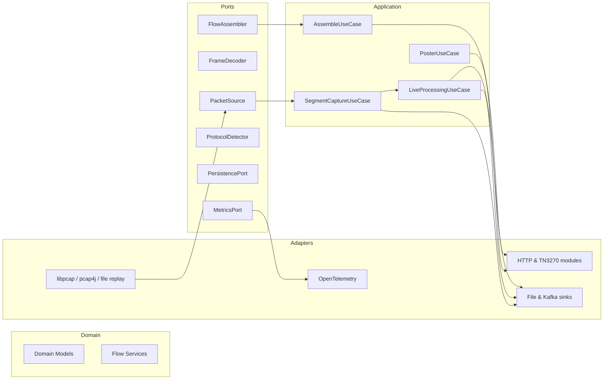

# RADAR

## Overview
RADAR is a high-performance Java SE application that captures TCP traffic, reassembles protocol conversations, and streams the results to file or Kafka sinks. The platform follows a strict hexagonal architecture: the domain core stays pure Java, application use cases coordinate the capture -> assemble -> sink stages, and adapters integrate capture libraries, persistence layers, and telemetry without leaking implementation details back into the core. The pipeline is tuned for sustained 40 Gbps workloads with defensive validation and comprehensive instrumentation.

## Key Features
- Ports-and-adapters layout across domain, application, and adapter packages for clean extensibility.
- Capture-to-sink throughput engineered with bounded queues, worker pools, and buffer reuse to control GC pressure.
- Executor-based persistence with tunable worker count and queue capacity plus graceful shutdown semantics.
- OpenTelemetry instrumentation (metrics, spans, logs) with OTLP export and consistent resource attributes.
- Pluggable sinks: rotating segment files, HTTP/TN3270 pair writers, and Kafka producers for downstream analytics.
- Hardened validation, fail-fast error handling, and SLF4J logging with no `System.out` usage.

## Quick Start
```bash
# build (tests, coverage, quality gates)
mvn -q -DskipTests=false verify

# prepare config (edit capture/live sections as needed)
cp config/radar-example.yaml ./radar-local.yaml

# run (offline pcap -> file sink, CLI overrides still win)
java -jar target/RADAR-0.1.0-SNAPSHOT.jar capture --config=./radar-local.yaml \
  pcapFile=/path/to/input.pcap \
  out=/tmp/radar/out \
  persistWorkers=6 \
  persistQueueCapacity=768

# enable metrics (OTLP)
export OTEL_METRICS_EXPORTER=otlp
export OTEL_EXPORTER_OTLP_ENDPOINT=http://localhost:4317
export OTEL_RESOURCE_ATTRIBUTES=service.name=radar,deployment.environment=dev
```
Adjust the jar name if your Maven build produces a different classifier or version suffix.

## YAML Config Quickstart
- Copy `config/radar-example.yaml` and adjust per environment; unmentioned keys fall back to embedded defaults.
- Launch with `java -jar radar.jar <mode> --config=/path/to/radar.yaml`; CLI key=value flags still override YAML with a WARN.
- See `OPS_RUNBOOK.md` for per-mode parameter tables, validation rules, and tuning playbooks.


## Configs & CLI Flags
> YAML keys mirror these names; append `key=value` arguments when temporary overrides are needed.
| Flag | Applies | Description | Default |
| --- | --- | --- | --- |
| `pcapFile` | `capture` | Absolute path to a pcap/pcapng file for offline replay. | unset |
| `iface` | `capture`, `live` | Network interface to sniff when `pcapFile` is not provided. | platform default (`eth0`) |
| `out` | `capture`, `live`, `assemble`, `poster` | Target directory for segments, message pairs, or reports. Prefix with `kafka:` to stream to Kafka. | varies per command |
| `ioMode` | `capture`, `live` | `FILE` writes rotating `.segbin` files; `KAFKA` streams to Kafka (`kafkaBootstrap` required). | `FILE` |
| `persistWorkers` | `live` | Number of persistence executor threads. | `max(2, cores/2)` |
| `persistQueueCapacity` | `live` | Bounded queue depth feeding persistence workers. | `persistWorkers * 128` |
| `metricsExporter` | all CLIs | `otlp` to emit OpenTelemetry metrics, `none` to disable emission. | `otlp` |
| `otelEndpoint` | all CLIs | OTLP metrics endpoint override (`http[s]://host:4317`). | unset |
| `otelResourceAttributes` | all CLIs | Comma-separated `key=value` pairs applied to OTEL resource attributes. | unset |
| `kafkaBootstrap` | `capture`, `live`, `poster` | Comma-separated Kafka bootstrap servers when using Kafka sinks. | required for Kafka mode |
| `--verbose` | all CLIs | Raises logging to DEBUG before dispatching the subcommand. | `INFO` |
| `--dry-run` | `capture`, `assemble` | Validate configuration and print the execution plan without starting the pipeline. | disabled |

Command-specific help (`java -jar ... capture --help`, etc.) lists every supported flag.

## Architecture at a Glance

Read the full design, package map, and pipeline breakdown in `docs/ARCHITECTURE.md`.

## Telemetry
All pipelines emit OpenTelemetry metrics, spans, and logs through the `MetricsPort` abstraction and shared OTel bootstrap. Core metrics include `capture.segment.persisted`, `live.persist.queue.depth`, `live.persist.latencyNanos`, `assemble.pairs.persisted`, and protocol histograms such as `protocol.http.bytes`. Enable OTLP exporters via environment variables or CLI flags and consult `docs/TELEMETRY_GUIDE.md` for catalogues, dashboards, and verification steps.

## Documentation Index
- `docs/ARCHITECTURE.md` - Hexagonal architecture, module map, diagrams, extensibility points.
- `docs/OPS_RUNBOOK.md` - Operational procedures, deployment profiles, troubleshooting playbooks.
- `docs/DEVELOPER_GUIDE.md` - Onboarding, coding standards, extension recipes.
- `docs/TELEMETRY_GUIDE.md` - Metric catalogue, enablement instructions, dashboard guidelines.
- `docs/UPGRADE_GUIDE.md` - Versioning policy, breaking changes, migration steps.
- `CHANGELOG.md` - Release history following Keep a Changelog conventions.
- `CONTRIBUTING.md` - Branching model, PR checklist, and quality gates.
- Module README files under `src/main/java/ca/gc/cra/radar/**/README.md` document package-level responsibilities.

## Support and Security
Report issues with sanitized logs, redacted payloads, and configuration snippets only; never share live packet captures or secrets. Escalate security concerns privately to maintainers. Configure credentials (Kafka, collectors, storage) through environment variables or secret stores rather than embedding them in configuration files or documentation.


