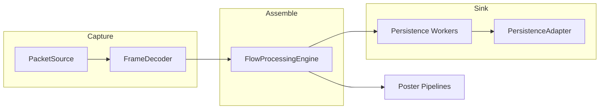

# RADAR

## Overview
RADAR is a high-throughput Java SE application that captures TCP traffic, reassembles flows, and renders protocol conversations using a hexagonal (ports and adapters) architecture. The domain core remains pure Java while adapters handle capture, protocol modules, persistence sinks, and telemetry so the pipeline scales to sustained 40 Gbps workloads.

## Key Features
- Hexagonal ports/adapters keep capture, assemble, and sink pipelines decoupled and testable.
- Capture to sink orchestration tuned for 40 Gbps targets with bounded queues and backpressure-aware retry loops.
- Buffer pooling and streaming IO adapters minimise allocations and GC pressure across hot paths.
- Executor-based persistence layer with tunable worker count and queue capacity for live processing.
- OpenTelemetry metrics, traces, and logs emitted consistently across capture, assemble, and poster stages.
- Pluggable sinks: file-based segment/blob outputs and Kafka topic adapters for downstream analytics.
- Hardened input validation, fail-fast error handling, and structured SLF4J logging (no System.out).

## Quick Start
```bash
# build
mvn -q -DskipTests=false verify

# run (offline pcap -> file sink)
java -jar target/RADAR-0.1.0-SNAPSHOT.jar capture   pcapFile=/path/to/input.pcap   out=/tmp/radar-out   --allow-overwrite

# enable metrics (OTLP)
export OTEL_METRICS_EXPORTER=otlp
export OTEL_EXPORTER_OTLP_ENDPOINT=http://localhost:4317
export OTEL_RESOURCE_ATTRIBUTES=service.name=radar,deployment.environment=dev
```
Replace the jar name if your Maven build produces a different classifier.

## Configs & CLI Flags
| Flag | Applies | Description | Default |
| --- | --- | --- | --- |
| `pcapFile` | `capture` | Absolute path to a pcap/pcapng file replayed instead of live capture. | unset |
| `iface` | `capture`, `live` | Network interface to sniff when `pcapFile` is not provided. | `eth0` |
| `out` | `capture`, `live` | Directory for rotated `.segbin` segment files (FILE mode). | `~/.radar/out/capture/segments` |
| `persistWorkers` | `live` | Number of persistence executor threads. | `min(4, max(1, cores/2))` |
| `persistQueueCapacity` | `live` | Bounded queue capacity feeding persistence workers. | `persistWorkers * 64` |
| `metricsExporter` | all CLIs | `otlp` enables OpenTelemetry export, `none` disables metric emission. | `otlp` |
| `otelEndpoint` | all CLIs | OTLP endpoint override for metrics export. | unset (collector default) |
| `otelResourceAttributes` | all CLIs | Comma-delimited resource attributes forwarded to OTel. | unset |
| `--verbose` | all CLIs | Elevates logging to DEBUG before dispatching the subcommand. | INFO |

## Architecture at a Glance

Read the full design, package map, and extensibility notes in [docs/ARCHITECTURE.md](docs/ARCHITECTURE.md).

## Telemetry
OpenTelemetry spans the entire pipeline. Metrics such as `capture.segment.persisted`, `assemble.pairs.persisted`, `live.persist.queue.highWater`, and `protocol.http.bytes` are emitted via the `MetricsPort` abstraction, and OTLP export is enabled by default. See [docs/TELEMETRY_GUIDE.md](docs/TELEMETRY_GUIDE.md) for enablement steps, metric catalogues, and alerting guidance.

## Documentation
- [docs/OPS_RUNBOOK.md](docs/OPS_RUNBOOK.md) — operational procedures, tuning, and troubleshooting.
- [docs/DEVELOPER_GUIDE.md](docs/DEVELOPER_GUIDE.md) — onboarding, coding standards, and extension recipes.
- [docs/TELEMETRY_GUIDE.md](docs/TELEMETRY_GUIDE.md) — metric catalogue, collector setup, and validation.
- [docs/UPGRADE_GUIDE.md](docs/UPGRADE_GUIDE.md) — versioning policy, breaking changes, and migration steps.
- [docs/ARCHITECTURE.md](docs/ARCHITECTURE.md) — hexagonal layout, data flow, and diagrams.
- [CHANGELOG.md](CHANGELOG.md) — release history following Keep a Changelog.
- [CONTRIBUTING.md](CONTRIBUTING.md) — pull-request checklist and contribution standards.

## Support and Security
Report defects or security findings through the issue tracker with sanitized logs and without attaching packet payloads or secrets. Configuration secrets (Kafka credentials, collector endpoints) must be provided via environment variables or secret stores; never commit them to the repository or include them in issues.

