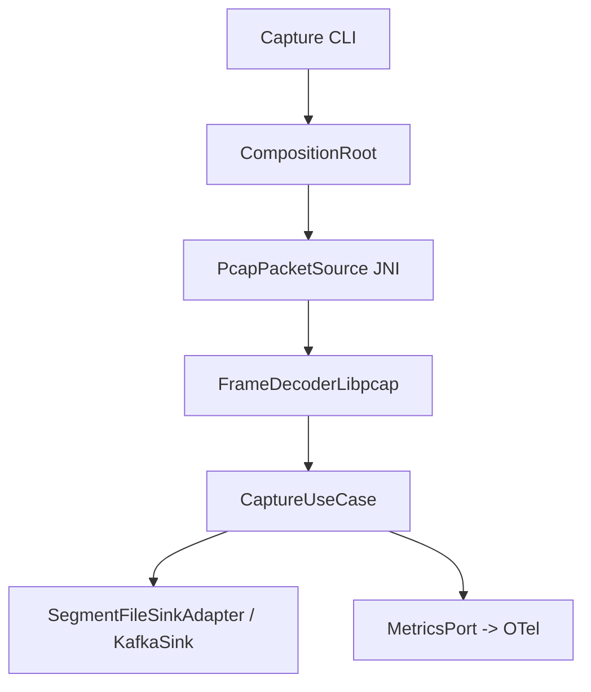
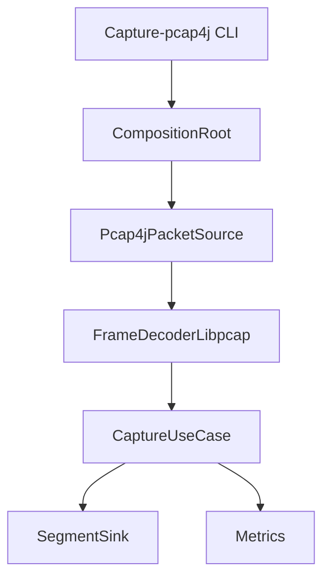
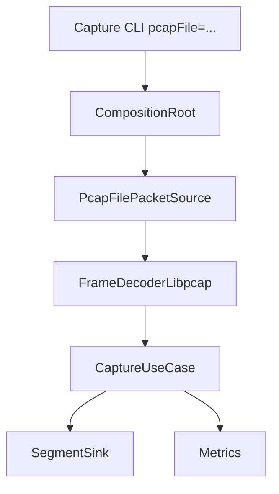
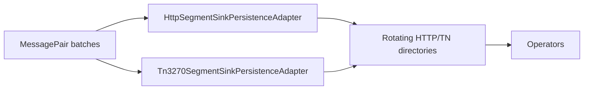
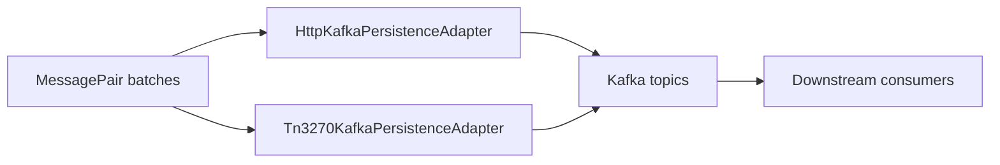
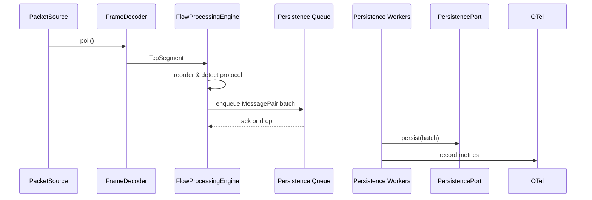
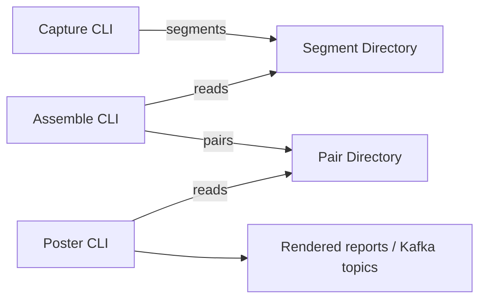
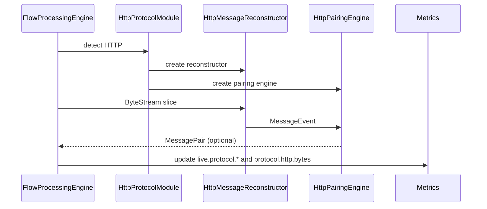
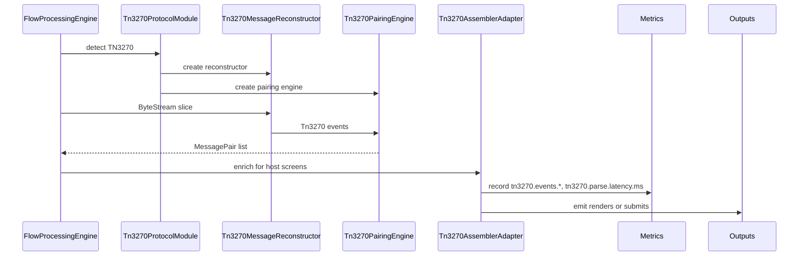

# RADAR Architecture

## Hexagonal Overview
RADAR enforces ports-and-adapters boundaries to keep the domain core independent from infrastructure concerns.
- **Domain (`ca.gc.cra.radar.domain`)** - Immutable models (segments, flows, protocol events) and pure services such as `FlowDirectionService`.
- **Application (`ca.gc.cra.radar.application`)** - Use cases (`SegmentCaptureUseCase`, `LiveProcessingUseCase`, `AssembleUseCase`, `PosterUseCase`) plus ports (`PacketSource`, `FrameDecoder`, `PersistencePort`, `MetricsPort`, `ProtocolDetector`).
- **Adapters (`ca.gc.cra.radar.infrastructure`, `ca.gc.cra.radar.adapter`, `ca.gc.cra.radar.api`)** - Implement ports using libpcap/pcap4j capture, Kafka and file persistence, protocol modules, telemetry, and CLI wiring.
- **Composition (`ca.gc.cra.radar.config`)** - `CompositionRoot` translates configuration into dependency graphs so each CLI remains thin.

## Package Map
| Package | Responsibility |
| --- | --- |
| `domain.capture` | Segment record definitions and rotation constants. |
| `domain.flow` | Flow orientation and direction heuristics. |
| `domain.msg` | Reconstructed message events and paired messages. |
| `domain.protocol` | Protocol identifiers and TN3270 domain types. |
| `application.port` | Hexagonal ports for capture, assembly, persistence, metrics, clock, and TN3270 assembler. |
| `application.pipeline` | Orchestrates capture, live, assemble, and poster pipelines. |
| `application.util` | Pairing helpers, EMAs, and batching utilities. |
| `infrastructure.capture.{live|file|pcap}` | Packet sources for libpcap JNI, pcap4j, and offline replay. |
| `infrastructure.net` | Flow assemblers, frame decoders, buffer pools. |
| `infrastructure.protocol.{http|tn3270}` | Protocol detection, reconstruction, pairing, Kafka poster. |
| `infrastructure.persistence.{segment|http|tn3270}` | File-based persistence adapters and decorators. |
| `adapter.kafka` | Kafka-based sinks and readers. |
| `infrastructure.metrics` | OpenTelemetry bootstrap and `MetricsPort` implementation. |
| `api` | CLI entry points, argument parsing, telemetry bootstrap, logging configuration. |
| `config` | Configuration records, validation, and the `CompositionRoot`. |

## Data Flow
1. **Capture** - A `PacketSource` (libpcap JNI or pcap4j) emits `RawFrame` objects which the `FrameDecoder` converts to `TcpSegment` instances.
2. **Filtering** - `SegmentCaptureUseCase` discards pure ACKs, persists the remaining segments, and emits `capture.segment.*` metrics.
3. **Assembly** - `FlowProcessingEngine` reorders bytes, detects protocols, and yields `MessagePair` objects via reconstructor and pairing factories.
4. **Persistence** - File and Kafka adapters implement `PersistencePort`/`SegmentPersistencePort` to write segments or pairs, emitting `live.persist.*` and `assemble.*` metrics.
5. **Poster** - Optional pipeline renders persisted conversations to analyst-friendly outputs or Kafka topics.

## Concurrency Model
- Live capture uses a fixed executor sized by `persistWorkers` (default `max(2, cores/2)`) and a bounded queue sized by `persistQueueCapacity` (default `workers * 128`).
- Enqueue attempts back off after 200 microseconds and drop after 10 ms, incrementing `live.persist.enqueue.retry` or `live.persist.enqueue.dropped` metrics.
- Worker threads batch up to 32 message pairs, record latency histograms (`live.persist.latencyNanos`, `live.persist.latencyEmaNanos`), and track queue high-water marks.
- Shutdown drains queues, joins workers with a five-second timeout, and escalates to `live.persist.shutdown.force` metrics when forced.
- Flow assembly itself is single-threaded per pipeline to preserve ordering; adapters remain responsible for their own thread safety.

## Capture Pipelines
### Live (JNI / libpcap)

### Live (pcap4j)

### Offline (pcap replay)

## Sink Pipelines
### File I/O

### Kafka

## End-to-End Pipelines
### Live (Single Process)

### Three-Process Mode (capture -> assemble -> poster)

## Protocol Flows
### HTTP Reconstruction

### TN3270 Reconstruction

## Extensibility Points
- **Protocols** - Register a `ProtocolId`, supply `ProtocolModule`, `MessageReconstructor`, and `PairingEngine` factories in `CompositionRoot`, and document telemetry additions.
- **Capture strategies** - Implement `PacketSource` (and `FrameDecoder` if required), wire through `CaptureConfig`, and emit `capture.*` metrics for success and failure paths.
- **Persistence sinks** - Implement `PersistencePort` or `SegmentPersistencePort`, honour batching semantics, and emit `live.persist.*` or `assemble.*` counters and histograms.
- **Telemetry adapters** - Provide alternative `MetricsPort` implementations if integrating with other monitoring stacks; retain metric naming conventions and attach the `radar.metric.key` attribute.
- **Buffer management** - Reuse infrastructure buffer pools when building adapters to minimise heap churn.

Every extension must include unit tests, telemetry updates, and documentation changes (README, guides, diagrams) per the RADAR meta-prompt.

