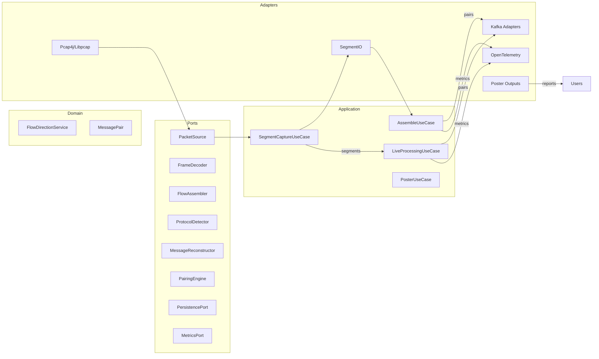
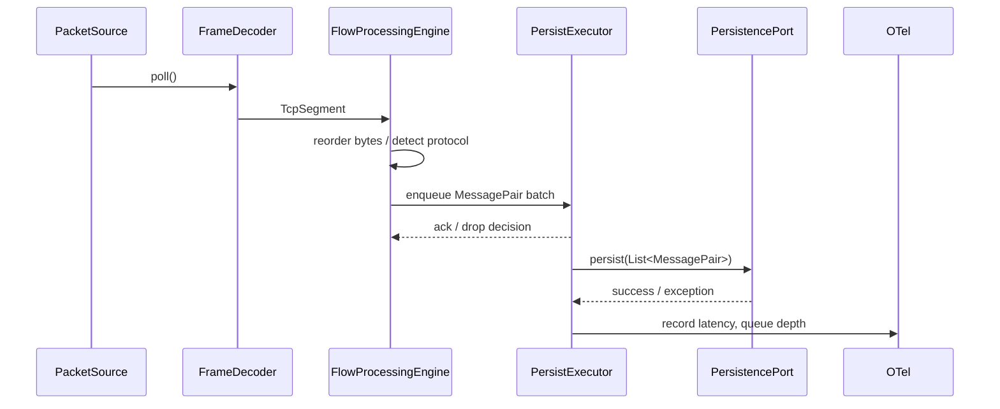

# RADAR Architecture

## Hexagonal Overview
RADAR follows a strict ports-and-adapters (hexagonal) design:
- **Domain core (`ca.gc.cra.radar.domain`)** — immutable flow, message, and protocol models plus pure services such as `FlowDirectionService`.
- **Application layer (`ca.gc.cra.radar.application`)** — orchestrates use cases (capture, live, assemble, poster) against abstract ports.
- **Ports (`ca.gc.cra.radar.application.port`)** — input/output contracts for packet sources, flow assemblers, protocol detectors, persistence sinks, metrics, and clocks.
- **Adapters (`ca.gc.cra.radar.infrastructure`, `ca.gc.cra.radar.adapter`, `ca.gc.cra.radar.api`)** — implement ports using libpcap/pcap4j, Kafka producers/consumers, file writers, OpenTelemetry metrics, and CLI wiring.

The `CompositionRoot` assembles these layers so the domain remains independent of transport, telemetry, or persistence concerns.

## Module Map
| Package | Responsibility |
| --- | --- |
| `ca.gc.cra.radar.domain.capture` | Segment record definitions and rotation constants. |
| `ca.gc.cra.radar.domain.flow` | Flow orientation helpers (client/server tracking). |
| `ca.gc.cra.radar.domain.msg` | Reconstructed message events and pairs. |
| `ca.gc.cra.radar.application.pipeline` | Use cases: `SegmentCaptureUseCase`, `LiveProcessingUseCase`, `AssembleUseCase`, `PosterUseCase`. |
| `ca.gc.cra.radar.application.port` | Hexagonal contracts for capture, assembly, persistence, metrics, and poster outputs. |
| `ca.gc.cra.radar.infrastructure.capture.{live|file|pcap}` | PacketSource implementations (libpcap JNI, pcap4j, file replay) and shared capture utilities. |
| `ca.gc.cra.radar.infrastructure.net` | Flow assembler adapters with buffer pools and out-of-order handling. |
| `ca.gc.cra.radar.infrastructure.protocol.{http,tn3270}` | Protocol modules wiring detectors, reconstructors, and pairing engines. |
| `ca.gc.cra.radar.infrastructure.persistence` | File/Kafka persistence adapters and Segment IO helpers. |
| `ca.gc.cra.radar.infrastructure.metrics` | Metrics adapters including the OpenTelemetry bootstrap. |
| `ca.gc.cra.radar.adapter.kafka` | Kafka-specific adapters for poster and persistence pipelines. |
| `ca.gc.cra.radar.api` | CLI entrypoints, argument parsing, telemetry bootstrap, and logging configuration. |
| `ca.gc.cra.radar.config` | Configuration records, validation, and the dependency injection root. |

## Data Flow
1. **Capture** — `PacketSource` (libpcap or pcap4j) polls frames which `FrameDecoder` translates into `TcpSegment`s.
2. **Filtering** — `SegmentCaptureUseCase` filters pure ACKs, persists segments (file or Kafka), and emits `capture.segment.*` metrics.
3. **Assembly** — `FlowProcessingEngine` orders bytes per flow, detects protocols, and routes to protocol-specific reconstructors and pairing engines.
4. **Persistence** — `PersistencePort` implementations write `MessagePair`s to rotating blob/index files or Kafka topics while emitting `assemble.*` or `live.*` metrics.
5. **Poster** — Optional pipelines render persisted conversations to human-readable files or publish processed payloads.

## Concurrency Model
- Live processing creates a bounded queue (`ArrayBlockingQueue` or `LinkedBlockingQueue`) sized by `persistQueueCapacity` and serviced by a fixed executor sized by `persistWorkers`.
- Enqueue attempts spin briefly, back off (`200 µs`), and drop pairs after `10 ms` with metrics/logs (`live.persist.enqueue.retry`, `live.persist.enqueue.dropped`).
- Worker threads batch up to 32 pairs, propagate MDC context, and record latency histograms (`live.persist.latencyNanos`, `live.persist.latencyEmaNanos`).
- Shutdown waits up to five seconds for drain, then escalates to forced termination (`live.persist.shutdown.force`) while closing persistence adapters safely.
- Capture and assemble pipelines remain single-threaded for deterministic ordering; heavy work is isolated in adapters and persistence workers.

## Component Diagram

## Packet to Persistence Sequence

## Extensibility Points
- **Protocols** — Register a new `ProtocolId`, implement `ProtocolModule`, `MessageReconstructor`, and `PairingEngine`, then wire them in `CompositionRoot`.
- **Capture strategies** — Implement `PacketSource` (live NIC, file format, Kafka replay) and associated `FrameDecoder` if needed; register via `CaptureConfig`/`CompositionRoot`.
- **Persistence sinks** — Implement `PersistencePort` (for assembled pairs) or `SegmentPersistencePort` (for capture) and plug in through configuration; ensure metrics and tests cover new sinks.
- **Metrics adapters** — Implement `MetricsPort` to integrate with alternate telemetry stacks while respecting concurrency and latency expectations.
- **Buffer management** — Reuse `infrastructure.buffer.BufferPool` utilities for custom adapters to maintain low allocation overhead.

All new adapters must emit OpenTelemetry metrics consistent with existing naming (`capture.*`, `assemble.*`, `live.*`, `protocol.*`) and document the signals in the Telemetry Guide.

